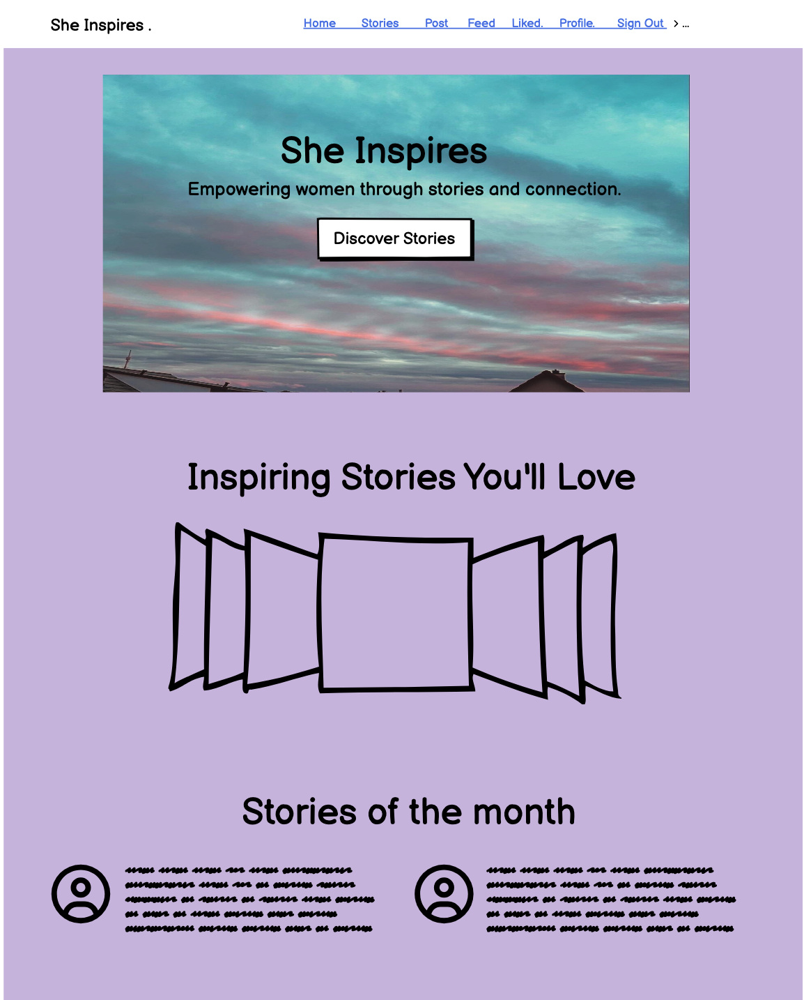
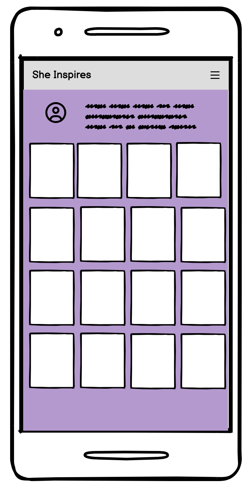
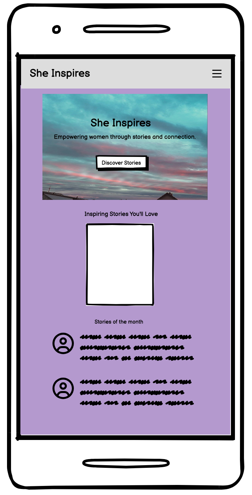
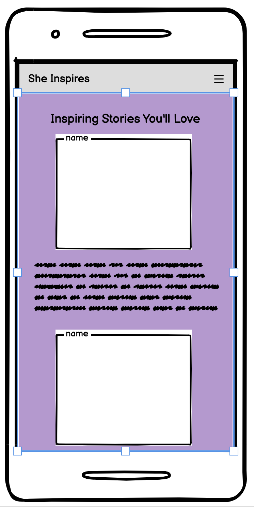

# She Inspires 🌟

Empowering women through stories, experiences, and resources.

## ✨ Vision

She Inspires is a platform designed to celebrate women's achievements, foster a supportive community, and provide resources for personal and professional growth.

You can try out a live demo of She Inspires deployed on Heroku here: [https://she-inspires-3dbf32b2af97.herokuapp.com/](https://she-inspires-3dbf32b2af97.herokuapp.com/)
And its API here: [https://sheapi-001672ab3b00.herokuapp.com/](https://sheapi-001672ab3b00.herokuapp.com/)


## 🌟 Main Features of She Inspires
She Inspires is a dynamic social media platform tailored to celebrate and empower women through a variety of inspirational content. Users can engage with posts, quotes, and images that resonate with their personal experiences and aspirations. One of the standout features of the platform is the Stories section, which showcases the lives and achievements of famous women throughout history, offering users a glimpse into their impactful journeys. While users can interact with content and share their thoughts, only the site administrators have the capability to add new stories. The platform supports user authentication, allowing individuals to sign up, log in, and manage their accounts securely with their usernames and passwords. This blend of features creates a vibrant and supportive community dedicated to inspiring and uplifting women from all walks of life.

## 🎨 UX Design Philosophy

* **User-Centric Design:**
  * **Strategy Plane:** The platform is built around the needs of women, focusing on understanding their goals and creating an inclusive and welcoming space. 

* **Intuitive Navigation:**
  * **Scope Plane:** A clear and easy-to-use navigation structure is designed to include all necessary features and content. We define functional requirements and organize content, ensuring users can quickly find the information they need.

* **Engaging Content:**
  * **Structure Plane:** Stories and articles are structured to be visually appealing and interactive. We focus on organizing information in a user-friendly manner, using wireframes and user flows to enhance accessibility and engagement.

* **Responsive Design:**
  * **Skeleton Plane:** The platform adapts seamlessly to different devices (desktops, tablets, and mobile phones). This involves creating layouts and visual hierarchies that ensure a consistent and effective user experience across various screen sizes.

* **Supportive Community:**
  * **Surface Plane:** Features like comments and social sharing are visually integrated to encourage connection and engagement between users. The final visual design incorporates elements that enhance the overall user experience and reflect the platform's supportive nature.

## 🙏 User Stories

**1. Viewing Inspirational Stories**
* **Title:** View Inspirational Stories
* **As a:** User
* **I want:** To browse a collection of inspirational stories and articles written by other users.
* **So that:** I can be motivated and find stories that resonate with my experiences and interests.

**2. Submitting a Story**
* **Title:** Submit a New Story
* **As a:** Registered user
* **I want:** To be able to submit my own story or article to the platform.
* **So that:** I can share my experiences and contribute to the community of inspiring stories.

**3. User Profile Management**
* **Title:** Manage My Profile
* **As a:** Logged-in user
* **I want:** To view and edit my profile information, including my bio, profile picture, and personal details.
* **So that:** I can keep my profile up-to-date and reflect my current experiences and achievements.

**4. Following Other Users**
* **Title:** Follow Other Users
* **As a:** User
* **I want:** To follow other users whose stories and updates I find inspiring.
* **So that:** I can receive updates and stay connected with their new content and activities.

**5. Commenting on Posts**
* **Title:** Comment on Posts
* **As a:** User
* **I want:** To be able to comment on posts I read.
* **So that:** I can engage in discussions, provide feedback, and interact with other users.

**6. Logging Out**
* **Title:** Log Out
* **As a:** Logged-in user
* **I want:** To log out of my account.
* **So that:** I can securely end my session and ensure that my account remains protected when I am not actively using the platform.

## 📋 Mock-Ups

### 1. Home Page
* **Description:** The Home Page is designed to feature a clean and welcoming layout with prominent sections for inspirational stories, featured articles, and user engagement features.
  - **Top Navigation Bar:** Includes links to the Home, Stories, Profile, and Community Forum sections.
  - **Featured Stories:** A carousel or grid displaying highlighted stories and articles.
  - **Recent Posts:** A list of the most recent posts from the community.

* **Mock-Up Image:**
  
  [Home Page Mock-Up Mobile](src/assets/Mocksups/Homepage.png)

### 2. User Profile Page
* **Description:** The User Profile Page provides users with a personal space to view and manage their profile information and contributions.
  - **Profile Header:** Displays the user’s profile picture, name, and brief bio.
  - **Contribution List:** Shows a list of stories and articles submitted by the user.
  - **Edit Profile Button:** Allows users to update their profile information.

* **Mock-Up Image:**
  

### 3. Story Page
* **Description:** The Story Submission Form enables users to submit their own stories and articles for publication on the platform.
  - **Title Field:** Input for the story title.
  - **Content Area:** Text area for the main content of the story.
  - **Image:** A pictory of the hero of the story. 

* **Mock-Up Images:**
  
  

## 🚀 Technologies Used

**Front-End:**

*   HTML, CSS, JavaScript: The foundation of the website's structure and interactivity.
*   React.js: A component-based JavaScript library for building the user interface.
*   Bootstrap.js: A popular CSS framework for responsive design and UI elements.

**Back-End:**

*   Django REST Framework: A powerful toolkit for building RESTful APIs to serve data to the frontend.
*   PostgreSQL: A robust and reliable database for storing user data, stories, articles, etc.

## 🛠️ Getting Started

1. **Clone the repository:** 
   ```bash
   git clone https://github.com/doramagnoni/she-inspires.git
   git clone https://github.com/doramagnoni/sheapi.git

2.  **Install dependencies (frontend):**  `npm install`
3.  **Install dependencies (backend):** `pip install -r requirements.txt`
4.  **Setup the database:** `python manage.py migrate`
5.  **Run the frontend development server:**  `npm start`
6.  **Run the backend development server:**  `python manage.py runserver`


## 🛠️ Reusable React Components

Reusable components are a cornerstone of React architecture, promoting code reuse, maintainability, and consistency across your application. This section provides examples of reusable React components, showcasing how they can be utilized to build efficient and scalable applications.

Reusable components are self-contained units of code that can be used across different parts of an application. They help in:

1. **Reducing Code Duplication: Write a component once and use it multiple times, minimizing redundancy.
2. **Improving Maintainability: Centralize updates in one place, making it easier to manage changes.
3. **Enhancing Consistency: Ensure uniformity in UI and behavior across the application.

Examples of Reusable Components:

In the "She Inspires" project, we utilize reusable components like AvatarComponent and Asset to maintain consistency and streamline the development process. Below are examples of how these components are used across the application.

1. **The AvatarComponent is used to display user profile pictures or initials if an image is not available. This component ensures a consistent look and feel for user avatars throughout the application.

In a user profile page, the post page and the feed, the AvatarComponent can be used to display the user's profile picture or initials.

2. **Asset Component
The Asset component is used for displaying loading spinners, images, or messages when assets are being fetched or if there are no results.

The Asset component is used for displaying loading spinners, images, or messages when assets are being fetched or if there are no results.


##  🚀  Manual Testing

Manual testing is essential for ensuring that the "She Inspires" application functions correctly and provides a seamless user experience. Below are guidelines and steps to manually test the application, including test scenarios for various features.


** Prerequisites:
1. Setup: Ensure that the application is running locally or on a staging environment.

2. Browser: Use a modern web browser (e.g., Chrome, Firefox, Safari) to perform the tests.

3. User Accounts: Have access to different user roles (e.g., regular user, admin) if applicable.

** Testing Scenarios
1. User Authentication
Login:

Navigate to the login page.
Enter valid credentials and submit the form.
Verify successful login by checking for redirection to the dashboard or home page.
Check for the presence of user-specific elements (e.g., profile picture, username).
Logout:

Click on the logout button (usually found in the user menu or header).
Confirm that the user is logged out and redirected to the login page.
Registration:

Navigate to the registration page.
Fill out the registration form with valid details and submit.
Verify successful registration and automatic login or redirection to the login page.


2. Profile Management
View Profile:

Navigate to the user profile page.
Verify that the profile information (e.g., profile picture, bio, contact info) is displayed correctly.
Edit Profile:

Click the edit profile button.
Update profile information and save changes.
Verify that changes are reflected on the profile page.
Change Password:

Navigate to the password change section.
Enter the current password and a new password.
Save changes and verify that the new password is accepted for future logins.


3. Content Creation and Management
Create Post:

Navigate to the content creation page.
Enter details for a new post (e.g., title, content, image).
Submit the form and verify that the post appears in the user’s feed or profile.
Edit Post:

Navigate to an existing post.
Click the edit button and modify the post details.
Save changes and verify that the updated content is displayed correctly.
Delete Post:

Navigate to the post you want to delete.
Click the delete button and confirm the action.
Verify that the post is no longer visible.


4. User Interaction
Like/Comment on Post:

Navigate to a post in the feed.
Like the post and add a comment.
Verify that the like and comment are displayed correctly.
Follow/Unfollow User:

Navigate to another user’s profile.
Click the follow/unfollow button.
Verify that the action updates correctly on the profile and in the follower/following lists.

## 🚀 Lighthouse Test

Lighthouse is a tool developed by Google that helps developers with auditing web applications for performance, accessibility, and SEO. The following is a summary of the Lighthouse tests conducted for the She Inspires platform.

### Running Lighthouse Tests

To run Lighthouse tests, follow these steps:

1. **Open Google Chrome:** Lighthouse is integrated into Chrome DevTools.
2. **Navigate to Your Site:** Open the She Inspires site in Chrome.
3. **Open DevTools:** Right-click on the page and select **Inspect**, or press `Ctrl + Shift + I` (Windows/Linux) or `Cmd + Option + I` (Mac).
4. **Go to the Lighthouse Panel:**
   - Click on the **Lighthouse** tab in DevTools.
   - Select the desired categories for auditing (Performance, Accessibility, Best Practices, SEO, etc.).
5. **Run the Audit:**
   - Click **Generate report**.
   - Wait for the audit to complete, and review the report.

### Lighthouse Audit Results

Here’s a summary of the latest Lighthouse audit results for the She Inspires platform:

#### Performance

- **Score:** 38/100
- **Key Findings:**
  - **First Contentful Paint (FCP):** Consider optimizing resources to improve load times.
  - **Largest Contentful Paint (LCP):** Look into performance bottlenecks that affect rendering speed.
  - **Total Blocking Time (TBT):** Identify and reduce long tasks that block user interaction.
  - **Cumulative Layout Shift (CLS):** Ensure layout stability by reserving space for images and ads.

#### Accessibility

- **Score:** 95/100
- **Key Findings:**
  - **Color Contrast:** Passed
  - **Alt Text for Images:** Passed
  - **Keyboard Navigation:** Passed
  - **Recommendations:** No major accessibility issues found, but ensure that all interactive elements are accessible.

#### Best Practices

- **Score:** 75/100
- **Key Findings:**
  - **HTTPS:** Ensure all resources are served over HTTPS.
  - **JavaScript Errors:** Check for and fix any JavaScript errors.
  - **Safe Resources:** Make sure all third-party resources are secure.
  - **Recommendations:** Address any security and performance best practices that may impact user experience.

#### SEO

- **Score:** 100/100
- **Key Findings:**
  - **Meta Tags:** Present and correctly configured.
  - **Mobile-Friendliness:** Passed.
  - **Sitemap:** Present.
  - **Recommendations:** Continue to maintain excellent SEO practices and ensure metadata remains accurate and up-to-date.

## 🎯 Project Goals

*   **Showcase inspiring stories of women from diverse backgrounds.**
*   **Provide resources and tools for personal and professional development.**
*   **Foster a supportive online community for women.**
*   **Empower women to pursue their passions and achieve their goals.**

## 📋 Features (Planned)

*   **Article and Story Submission:**  Allow users to contribute their own stories and experiences.
*   **Community Forum:** A place for users to discuss topics related to women's empowerment.
*   **Mentorship Opportunities:**  Connect experienced women with those seeking guidance.


## 🗄️ Deployment write-up
To deploy She Inspires on Heroku, follow these steps:

Prerequisites:

Before diving into the deployment process, ensure you have the following:

*A Heroku account (sign up for a free tier if needed)
*Git installed on your local machine
*The complete She Inspires codebase, including both frontend and backend repositories, cloned to your local environment.


Preparing Your Project:

**1.To successfully deploy She Inspires to Heroku, several configuration files are essential:

*This file instructs Heroku on how to start your application.
*Create a file named Procfile at the root of your She Inspires project (where manage.py is located).
* Add the following line:
web: gunicorn she_inspires.wsgi --log-file -


**2. Generate a requirements.txt file:

*This file outlines the Python dependencies required for your backend.
*In your project's root directory, execute the following command:
 pip freeze > requirements.txt


 Deployment to Heroku:

**1.Initialize a Git repository:

*Navigate to your She Inspires project's root directory.
*If not already initialized, create a Git repository:

git init

**2. Connect to Heroku:

*Create a new app on your Heroku account.
*Add Heroku as a remote to your local Git repository:

git remote add heroku https://git.heroku.com/<sheapi>.git


**3. Push to Heroku:

*Ensure all code changes are committed to your local Git repository.
*Deploy your application to Heroku:

git push heroku master


**4. Access Your Deployed App:

*Once the deployment is complete, you can access your She Inspires application through the URL provided by Heroku.

##  Troubleshooting

**1. Formatting Issues and styling issues :**

* Uneven spacing
* Cashing issies
* Inconsistent formatting
* The dropdownmenu requires additional styling - it does not provide with user friendly experience. 

**Solutions:** Specificity and Overriding - I used ore specific selectors or !important to override conflicting styles. 


## 🙏 Acknowledgments

I want to express my sincere gratitude to the following individuals and resources for their invaluable contributions and support in the making of this project:

*   **ALl the tutors from Code Institude:** who helped me extensively to fix numerous problems with my code and supported me very patiently throughout all the stages of the creation of this portfolio. Especially to Rebecca, who always brought a smile to my face

*   **[Online Resource/Tutorial]:**  I used extensively the API walkthrough project provided by Code Institute as well as inspiration from the project Moments. 


